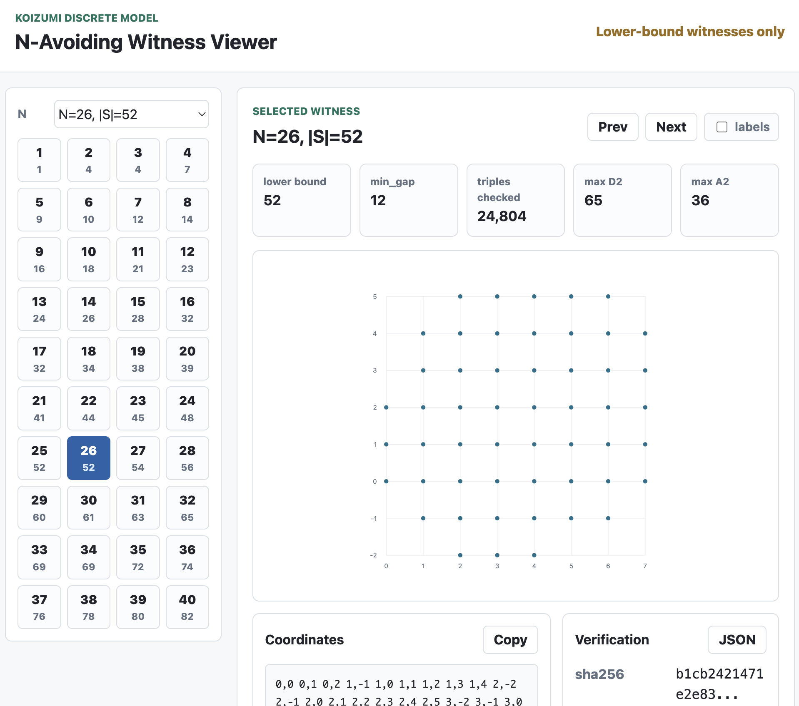

# Erdős Problem #352: Koizumi N-Avoiding Witness Table

This repository contains verified lower-bound witnesses for `N=1..40` in the
Koizumi discrete `N`-avoiding lattice model related to Erdős problem #352.

The model comes from Koizumi's comment in the discussion thread [1].  

The baseline rows `N=1..27` are from BorisAlexeev's later comment in the same
thread [2], and are reverified here in a uniform format.  The rows `N=28..40`
are the new extension provided here.

## Witness Table for `N=1..40`

Verified lower bounds `f(N) >= |S|` for `N=1..40`:

| N | 1 | 2 | 3 | 4 | 5 | 6 | 7 | 8 | 9 | 10 |
|---:|---:|---:|---:|---:|---:|---:|---:|---:|---:|---:|
| size | 1 | 4 | 4 | 7 | 9 | 10 | 12 | 14 | 16 | 18 |

| N | 11 | 12 | 13 | 14 | 15 | 16 | 17 | 18 | 19 | 20 |
|---:|---:|---:|---:|---:|---:|---:|---:|---:|---:|---:|
| size | 21 | 23 | 24 | 26 | 28 | 32 | 32 | 34 | 38 | 39 |

| N | 21 | 22 | 23 | 24 | 25 | 26 | 27 | 28 | 29 | 30 |
|---:|---:|---:|---:|---:|---:|---:|---:|---:|---:|---:|
| size | 41 | 44 | 45 | 48 | 52 | 52 | 54 | 56 | 60 | 61 |

| N | 31 | 32 | 33 | 34 | 35 | 36 | 37 | 38 | 39 | 40 |
|---:|---:|---:|---:|---:|---:|---:|---:|---:|---:|---:|
| size | 63 | 65 | 69 | 69 | 72 | 74 | 76 | 78 | 80 | 82 |


## You can check on the HTML viewer interactively!

Click here to open the interactive GitHub Pages viewer:
<https://kitaken1.github.io/erdos352-koizumi-n-avoiding-witness-table/>



Click the Pages link for this repository, pick an `N`, and the witness appears
as a lattice-point picture.  You can move through the table, inspect the
coordinates, and download the selected JSON witness.

## Mathematical Background: Koizumi's N-Avoiding Condition

A finite set `S` of lattice points is `N`-avoiding if every triple
`p, q, r in S`, with repetitions allowed, satisfies

```text
|area(p,q,r) - N| > diam(p,q,r).
```

## How The Witnesses Were Found

The witness table has two separate parts:

```text
generation/search:
  find a promising finite point set S

verification:
  prove that this particular S is N-avoiding by checking all triples exactly
```

This repository is mainly the public verification package, but the search
provenance is important.

Rows `N=1..27` are previously posted forum witnesses from BorisAlexeev's
comment in the Erdős Problems #352 discussion thread, posted at 03:17 on
2025-12-28.  The comment gives results up to `N=27` in the format `N`, `f(N)`,
and then a witness.  Those point lists were copied into a uniform JSON format
and reverified here.  For example, the `N=5` row is the `3 x 3` lattice block,
written in a different order in the source data.

Rows `N=28..40` were produced by a sequence of finite constructive searches:

```text
1. radial-prefix disk search
   Build a large candidate box, choose several fractional centers, sort lattice
   points by distance from the center, and keep the nearest points until the
   first forbidden triple appears.

2. local add-only repair
   Starting from the radial-prefix witness, look in a small neighborhood of the
   current bounding box and greedily add any point that preserves the condition.

3. fixed-box hitting-set search
   For selected boxes, build the forbidden-triple hypergraph and search for a
   larger independent set inside that finite box.  When it finds one, the new
   point set is again checked by the exact verifier.
```

The public script

```bash
python3 scripts/radial_prefix_search.py 5
```

reproduces the simple `N=5` `3 x 3` example and can find baseline examples for
other modest `N`.  It is intentionally a small construction aid, not the full
optimizer that produced every strongest row in the table.

The important logical point is that search is allowed to be heuristic: it only
needs to propose a candidate.  The lower-bound claim rests on the exact
verification step, which checks the final listed `S`.

## What Is Being Checked?

The verification program is a direct exhaustive check.  For each witness file,
it reads the finite point list and checks every triple of points, including
repeated triples.

Important: this verifier checks one proposed set `S`.  It does not search over
all possible lattice-point sets.  If the listed `S` passes, that proves the
existence of an `N`-avoiding set of size `|S|`, hence the lower bound
`f(N) >= |S|`.

It does not prove that `S` is largest possible.  To prove an exact value such
as `f(N) = |S|`, one would also need an upper-bound argument ruling out every
set of size `|S|+1`, including translated, rotated, and completely different
patterns.

For example, if a witness file lists 20 points, the verifier checks only the
triples chosen from those same 20 listed points.  With repetitions allowed,
that is

```text
20*21*22/6 = 1540
```

triple checks.  It is not checking all possible 20-point subsets of the
infinite lattice.

For each triple it computes:

```text
A2 = twice the triangle area
D2 = squared triangle diameter
gap = (A2 - 2N)^2 - 4D2
```

The witness is valid exactly when every triple has `gap > 0`.  The verifier
prints `min_gap`, the smallest gap among all checked triples.  A positive
`min_gap` means the witness passed.

## Why The Integer Test Is Equivalent

Let

```text
A = area(p,q,r)
d = diam(p,q,r)
A2 = 2A
D2 = d^2
```

The original condition is

```text
|A - N| > d.
```

Multiplying both sides by `2` gives

```text
|2A - 2N| > 2d.
```

Since `2A = A2`, this is

```text
|A2 - 2N| > 2d.
```

Both sides are nonnegative, so squaring preserves the inequality:

```text
(A2 - 2N)^2 > 4d^2.
```

Finally, `d^2 = D2`, hence

```text
(A2 - 2N)^2 > 4D2.
```

Equivalently, define

```text
gap = (A2 - 2N)^2 - 4D2.
```

Then the triple passes exactly when

```text
gap > 0.
```

This is useful because, for lattice points, `A2` and `D2` are integers.  The
verifier therefore uses only integer arithmetic, with no floating-point or
square-root rounding.


The listed set does not need to contain `(0,0)`.  For a lower-bound witness,
one valid finite set anywhere in the lattice is enough.  Some files are
translated to convenient coordinates only for readability.

Japanese explanation: [`docs/verification_ja.md`](docs/verification_ja.md).

## Detailed Table

These are verified lower bounds only.  A row with value `m` proves
`f(N) >= m`; it does not by itself prove `f(N) = m`.

Rows `N=1..27` are included as BorisAlexeev's previously posted/forum baseline
witnesses, reverified here in the same format.  The extension of interest is
`N=28..40`.

| N | verified lower bound | witness | source |
|---:|---:|---|---|
| 1 | 1 | `data/witnesses/n001_1.json` | BorisAlexeev forum comment [2] |
| 2 | 4 | `data/witnesses/n002_4.json` | BorisAlexeev forum comment [2] |
| 3 | 4 | `data/witnesses/n003_4.json` | BorisAlexeev forum comment [2] |
| 4 | 7 | `data/witnesses/n004_7.json` | BorisAlexeev forum comment [2] |
| 5 | 9 | `data/witnesses/n005_9.json` | BorisAlexeev forum comment [2] |
| 6 | 10 | `data/witnesses/n006_10.json` | BorisAlexeev forum comment [2] |
| 7 | 12 | `data/witnesses/n007_12.json` | BorisAlexeev forum comment [2] |
| 8 | 14 | `data/witnesses/n008_14.json` | BorisAlexeev forum comment [2] |
| 9 | 16 | `data/witnesses/n009_16.json` | BorisAlexeev forum comment [2] |
| 10 | 18 | `data/witnesses/n010_18.json` | BorisAlexeev forum comment [2] |
| 11 | 21 | `data/witnesses/n011_21.json` | BorisAlexeev forum comment [2] |
| 12 | 23 | `data/witnesses/n012_23.json` | BorisAlexeev forum comment [2] |
| 13 | 24 | `data/witnesses/n013_24.json` | BorisAlexeev forum comment [2] |
| 14 | 26 | `data/witnesses/n014_26.json` | BorisAlexeev forum comment [2] |
| 15 | 28 | `data/witnesses/n015_28.json` | BorisAlexeev forum comment [2] |
| 16 | 32 | `data/witnesses/n016_32.json` | BorisAlexeev forum comment [2] |
| 17 | 32 | `data/witnesses/n017_32.json` | BorisAlexeev forum comment [2] |
| 18 | 34 | `data/witnesses/n018_34.json` | BorisAlexeev forum comment [2] |
| 19 | 38 | `data/witnesses/n019_38.json` | BorisAlexeev forum comment [2] |
| 20 | 39 | `data/witnesses/n020_39.json` | BorisAlexeev forum comment [2] |
| 21 | 41 | `data/witnesses/n021_41.json` | BorisAlexeev forum comment [2] |
| 22 | 44 | `data/witnesses/n022_44.json` | BorisAlexeev forum comment [2] |
| 23 | 45 | `data/witnesses/n023_45.json` | BorisAlexeev forum comment [2] |
| 24 | 48 | `data/witnesses/n024_48.json` | BorisAlexeev forum comment [2] |
| 25 | 52 | `data/witnesses/n025_52.json` | BorisAlexeev forum comment [2] |
| 26 | 52 | `data/witnesses/n026_52.json` | BorisAlexeev forum comment [2] |
| 27 | 54 | `data/witnesses/n027_54.json` | BorisAlexeev forum comment [2] |
| 28 | 56 | `data/witnesses/n028_56.json` | this repository search |
| 29 | 60 | `data/witnesses/n029_60.json` | this repository search |
| 30 | 61 | `data/witnesses/n030_61.json` | this repository search |
| 31 | 63 | `data/witnesses/n031_63.json` | this repository search |
| 32 | 65 | `data/witnesses/n032_65.json` | this repository search |
| 33 | 69 | `data/witnesses/n033_69.json` | this repository search |
| 34 | 69 | `data/witnesses/n034_69.json` | this repository search |
| 35 | 72 | `data/witnesses/n035_72.json` | this repository search |
| 36 | 74 | `data/witnesses/n036_74.json` | this repository search |
| 37 | 76 | `data/witnesses/n037_76.json` | this repository search |
| 38 | 78 | `data/witnesses/n038_78.json` | this repository search |
| 39 | 80 | `data/witnesses/n039_80.json` | this repository search |
| 40 | 82 | `data/witnesses/n040_82.json` | this repository search |

The machine-readable summary is in `data/witness_table.json`, with a compact
CSV version in `data/witness_table.csv`.

## Verify

No third-party Python packages are required.

```bash
python3 scripts/verify_witnesses.py
python3 -m unittest
```

Expected result: every row reports `ok = yes`.

For a short explanation of the check:

```bash
python3 scripts/verify_witnesses.py --explain
```

To verify one file:

```bash
python3 scripts/verify_witnesses.py data/witnesses/n028_56.json
```

To print the table:

```bash
python3 scripts/print_table.py
```

## File Format

Each witness file has this shape:

```json
{
  "schema": "koizumi-n-avoiding-witness-v1",
  "claim": "verified_lower_bound",
  "N": 28,
  "size": 56,
  "points": [[0, 3], [0, 4]],
  "points_sha256": "..."
}
```

The actual files contain the complete point list and an exact verification
summary, including the minimum value of `(A2 - 2N)^2 - 4D2` over all triples.

## Construction Aid

`scripts/radial_prefix_search.py` is a small constructive search script:

```bash
python3 scripts/radial_prefix_search.py 30
```

It is included as a lightweight way to find baseline examples for modest `N`.
The JSON files in `data/witnesses/` are the authoritative public witness data.

## Scope

This repository is for lower-bound witness data in the Koizumi discrete model.
It is not a proof of the original continuous Erdős #352 problem.  It is also
not an upper-bound certificate package for the listed values.

## AI usage disclosure
The solution and code were made with assistance from Codex 5.5 using xhigh reasoning, and ChatGPT 5.5 pro.

## References

[1] J. Koizumi's comment formulating the `N`-avoiding model, Erdős Problems
#352 discussion thread, 17:37 on 2025-12-24:
https://www.erdosproblems.com/forum/thread/352

[2] BorisAlexeev's comment giving optimized data up to `N=27` in the format
`N`, `f(N)`, and witness, Erdős Problems #352 discussion thread, 03:17 on
2025-12-28:
https://www.erdosproblems.com/forum/thread/352
